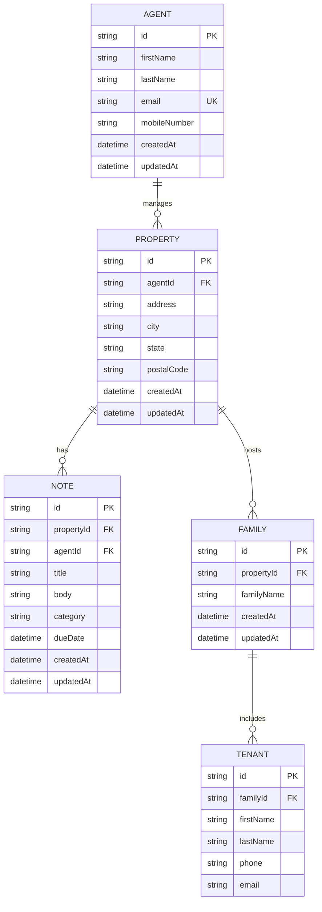

# ERD – Property Agent Domain

Below is a relational data model expressed in Mermaid. You can render it in GitHub or convert it to PNG/PDF if desired.

```mermaid
erDiagram
  AGENT ||--o{ PROPERTY : manages
  PROPERTY ||--o{ NOTE : has
  PROPERTY ||--o{ FAMILY : hosts
  FAMILY ||--o{ TENANT : includes

  AGENT {
    string id PK
    string firstName
    string lastName
    string email UK
    string mobileNumber
    datetime createdAt
    datetime updatedAt
  }

  PROPERTY {
    string id PK
    string agentId FK
    string address
    string city
    string state
    string postalCode
    datetime createdAt
    datetime updatedAt
  }

  FAMILY {
    string id PK
    string propertyId FK
    string familyName
    datetime createdAt
    datetime updatedAt
  }

  TENANT {
    string id PK
    string familyId FK
    string firstName
    string lastName
    string phone
    string email
  }

  NOTE {
    string id PK
    string propertyId FK
    string agentId FK
    string title
    string body
    string category
    datetime dueDate
    datetime createdAt
    datetime updatedAt
  }
```
